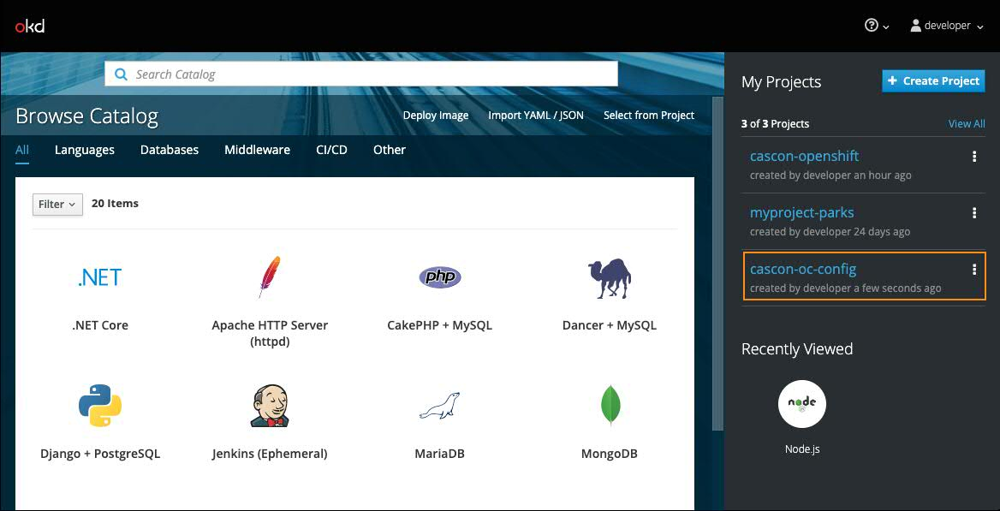

# OpenShift Configuration Lab

## Create a project

1.  Start minishift at a Commandline console

    ```bash
     minishift start
     eval $(minishift oc-env)
    ```

1.  Login into minishift

    ```bash
    oc login
    ```

    enter:

    #### Username: developer

    #### Password: developer

1.  Create a project

    ```bash
    oc new-project cascon-oc-config
    ```

## Create a Mongo DB

1. Open minishift web console

   ```bash
    minishift console
   ```

   A broswer window will open, then login with

   #### Username: developer

   #### Password: developer

1. Click on the project cascon-oc-config from the My Projects list on the right panel
   
1. click on Browse Catalog
   

1. Click on Databases tab and select Mongo and then click on MongoDB
   

1. Take all default settings, click on Next and then Create.

1. After creation, click on Show parameter values under Applied Parameter Values
   
1. Examine the parameters under Applied Parameter Values, we will bind the database connection information to a node application later.
   

## Create a Node application

1. Go back to Commandline console, set current project as cascon-oc-config

   ```bash
    oc project cascon-oc-config
   ```

1. Create a new node application under the project from the example github repository
   ```bash
    oc new-app https://github.com/jwsliu/nodejs-ex
   ```
1. Expose the node application
   ```bash
    oc expose svc nodejs-ex
   ```

## Binding environment variables from OpenShift secrets

The node application takes environment variables to confugure the database connection, we want to set these environment variables from OpenShift secrets.

1. Let's take a look at the application before we set environment variables. Go to minshift web console, expand nodejs-ex application and click on the url under Route
   

1. After the application is open in a new tab, you can see the database is not configued
   

1. Add a path "/env" to the application url, the application prints out all environment variables it can access.
   

1. Now, let's create some new environment vaiables and bind them to Mongo DB secrets. Go back to minishift web console, click on nodejs-ex under Deployment Config
   

1. Select on Environment tab and add a environment variable for database service name, DATABASE_SERVICE_NAME = mongodb
   

1. Click on Add Value from Config Map or Secret
   

1. Enter "MONGODB_USER" as Name, select "mongodb" secret and select the key as "database-user"
   
1. Repeat the last two steps to set these env variables

   ```bash
   Name                      secret       Key
   MONGODB_DATABASE          mongodb      database-name
   MONGODB_PASSWORD          mongodb      database-password
   MONGODB_ADMIN_PASSWORD    mongodb      database-admin-password
   ```

   then click save, you should have these env variables set like this:
   

1. Wait the application redeployment is completed, open the application url again, you should see the database info and page count.
   
1. Go to the env page again, you should see the new variables are listed in the page.
   
1. You can examine the secrets by oc commands
   ```bash
     oc login -u system:admin  # login as admin
     oc project cascon-oc-config # swtich to the project
     oc get secrets # list all secretes under the current project
     oc get secret mongodb -o yaml # get mongodb secret contents in yaml
   ```
   You should see the mongodb secret contents in yaml like this
   
1. If you are familar with Kubernetes commands, you can see the secrets by kubectl as well

   ```bash
    kubectl get namespace  # an openshift project has its own namespace
    kubectl get secrets -n cascon-oc-config # list all secretes under   the project of cascon-oc-config
    kubectl get secret mongodb -o yaml  -n cascon-oc-config # get mongodb secret contents in yaml
   ```

   You should see the same yaml contents from oc command
   
