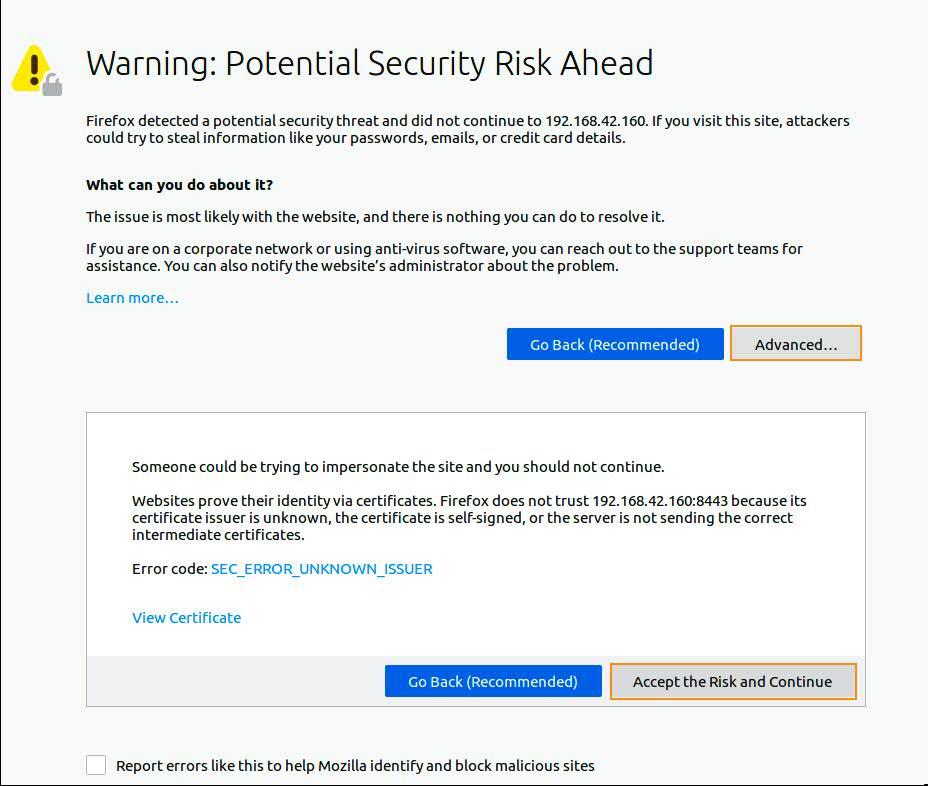

# Getting Started Minishift

## Start Minishift

1. Open a Mate Terminal

1. Sudo root
   ```bash
   sudo -s -H
   ```
1. Start minishift
   ```bash
   minishift start
   ```
   record the minishift console url for next step
1. Configure Path for oc
   ```bash
   eval $(minishift oc-env)
   ```
1. Login

   ```bash
   oc login
   ```

   enter Username: developer / Password: developer

## Open minishift console

1. Open the minishift console url from last step by a browser

1. Bypass the security risk warning by click on Advanced buttonn and then click on Accept the Risk and Continue
   

1. enter Username: developer / Password: developer to login
