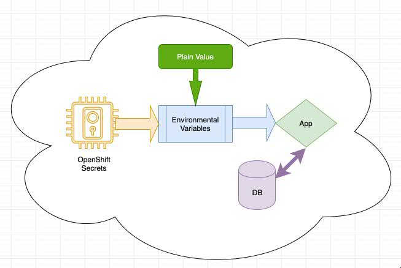
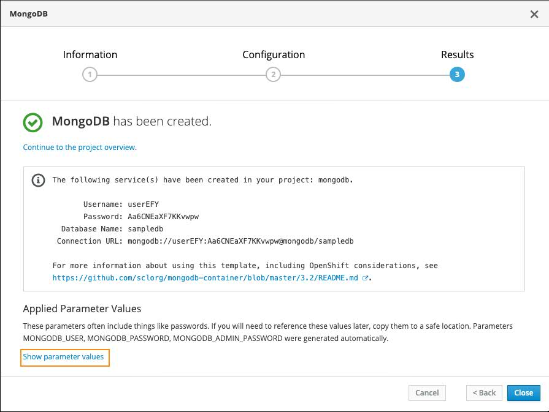
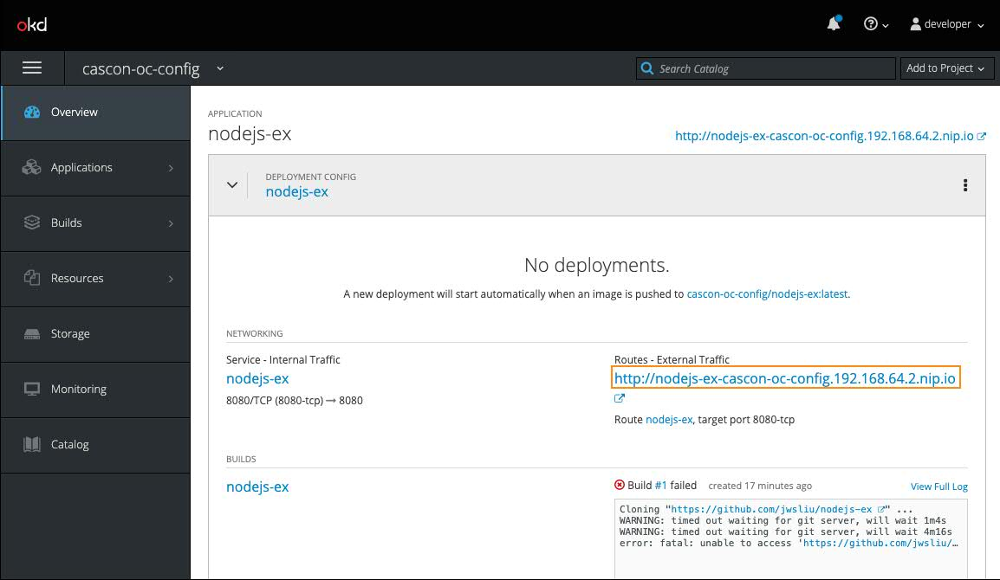
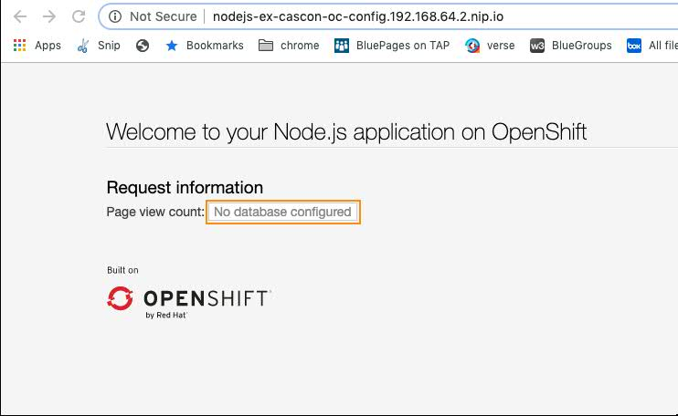
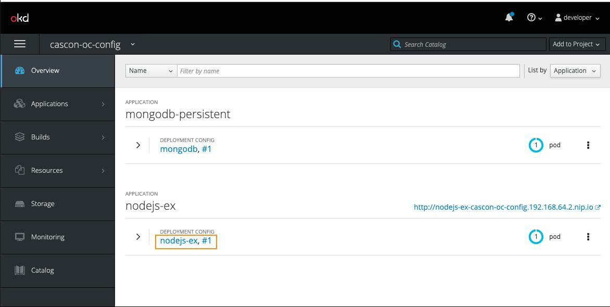
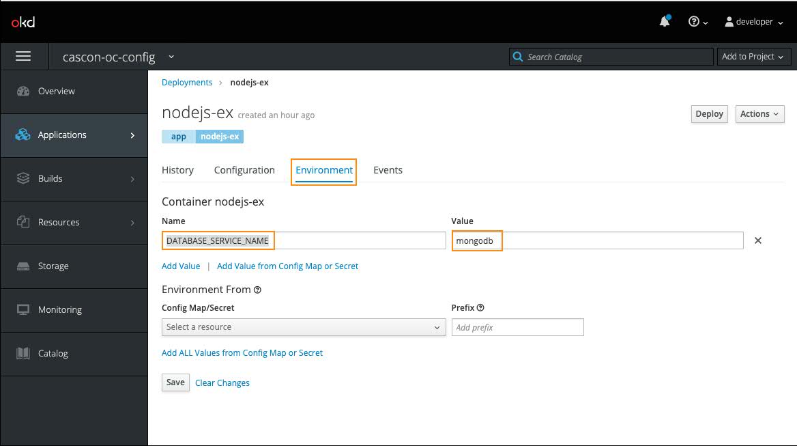
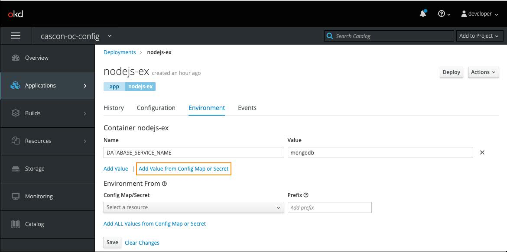
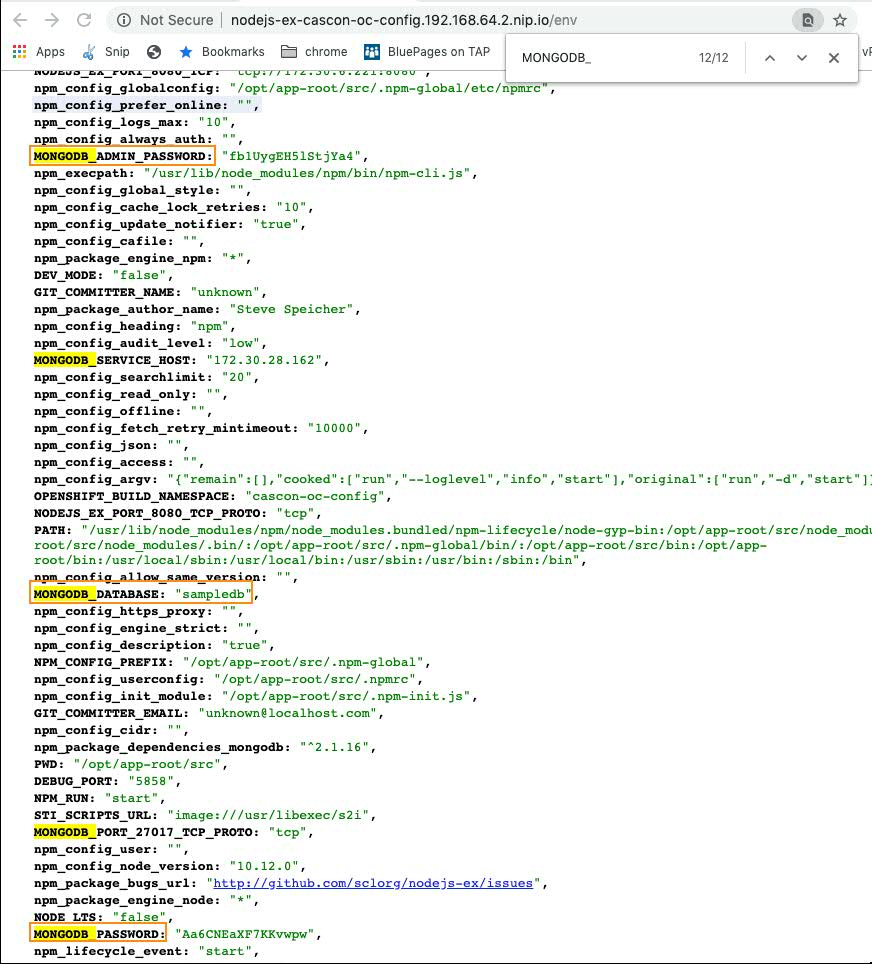
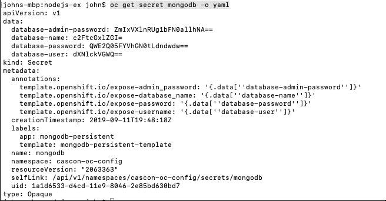

# OpenShift Configuration Lab

## Application Configuration Structure



## Create a Mongo DB

1. Click on the project we just created from the My Projects list on the right panel
   then click on Add to Project on the top-right corner and then select Browse Catalog

1. Click on Databases tab and select Mongo and then click on MongoDB
   

1. Take all default settings, click on Next and then Create.

1. After creation, click on Show parameter values under Applied Parameter Values
   
1. Examine the parameters under Applied Parameter Values, we will bind the database connection information to a node application later.
   

## Create a Node application (skip this step if we have created the application)

1. Go back to Commandline console, set current project as cascon-oc-config

   ```bash
    oc project cascon-oc-config
   ```

1. Create a new node application under the project from the example github repository
   ```bash
    oc new-app https://github.com/jwsliu/nodejs-ex
   ```
1. Expose the node application
   ```bash
    oc expose svc nodejs-ex
   ```

## Binding environment variables from OpenShift secrets

The node application takes environment variables to confugure the database connection, we want to set these environment variables from OpenShift secrets.

1. Let's take a look at the application before we set environment variables. Go to minshift web console, expand the application and click on the url under Route
   

1. After the application is open in a new tab, you can see the database is not configued
   

1. Add a path "/env" to the application url, the application prints out all environment variables it can access.
   

1. Now, let's create some new environment vaiables and bind them to Mongo DB secrets. Go back to minishift web console, click on the application under Deployment Config
   

1. Select on Environment tab and add a environment variable for database service name, DATABASE_SERVICE_NAME = mongodb
   

1. Click on Add Value from Config Map or Secret
   

1. Enter "MONGODB_USER" as Name, select "mongodb" secret and select the key as "database-user"
   
1. Repeat the last two steps to set these env variables

   ```bash
   Name                      secret       Key
   MONGODB_DATABASE          mongodb      database-name
   MONGODB_PASSWORD          mongodb      database-password
   MONGODB_ADMIN_PASSWORD    mongodb      database-admin-password
   ```

   then click save, you should have these env variables set like this:
   

1. Wait the application redeployment is completed, open the application url again, you should see the database info and page count.
   
1. Go to the env page again, you should see the new variables are listed in the page.
   
1. You can examine the secrets by oc commands
   ```bash
     oc login -u system:admin  # login as admin
     oc project cascon-oc-config # swtich to the project
     oc get secrets # list all secretes under the current project
     oc get secret mongodb -o yaml # get mongodb secret contents in yaml
   ```
   You should see the mongodb secret contents in yaml like this
   
1. You can also look at the project deployment configuration to see the bindings between the openshift secrets and environmental variables:
   ```bash
      oc get dc <application_name> -o ymal
   ```
   

## References:

1. The lab is inspired by the course "Application Deployment with Red Hat OpenShift Container Platform" provided by https://training-lms.redhat.com
1. Part of Lab example code are from https://github.com/sclorg/nodejs-ex and https://github.com/redhat-gpte-devopsautomation/PrintEnv
