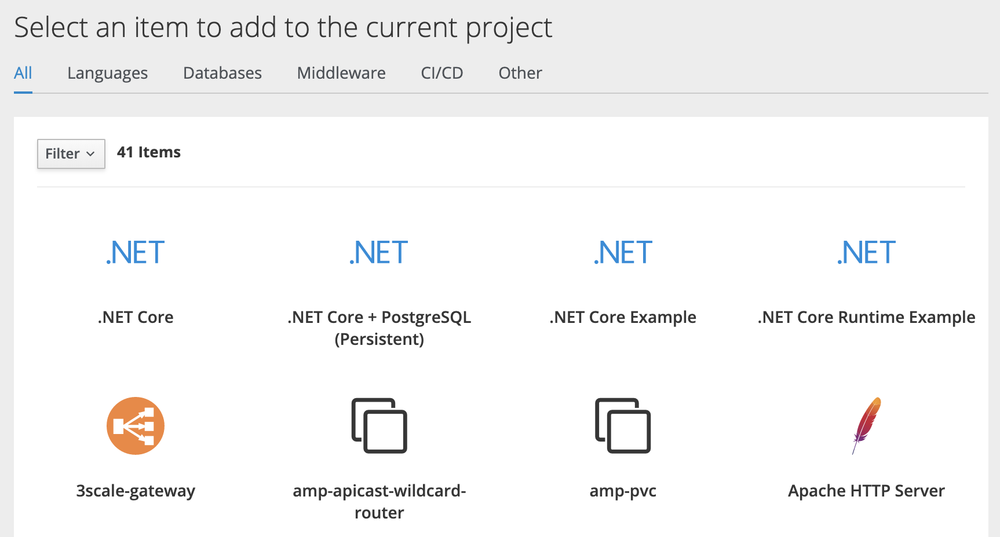
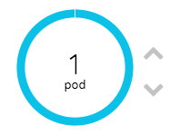

## Exploring The Web Console

### 1. Create a project

- Open minishift web console

  ```bash
   minishift console
  ```

  A broswer window will open, then login with

  ```bash
   Username: developer
   Password: developer
  ```

- After logging in to the web console, you'll see a blue button labeled **Create Project** in the top right corner of your screen that is shown below. Click this button to get started.  
  

- You should now see a page for creating your first project in the web console. Fill in the **Name** field as `myproject`.  
  

  The rest of the form is optional and up to you to fill in or ignore. Click **Create** to continue.
  After your project is created, your project will appear under **My Projects**, and you can click on `myproject` to access your newly created project.

### 2. Deploy an application

- To deploy an application, click the **Browse Catalog** button  
  

- Which will take you to the following page:  
  

- Scroll down and select **Node.js**  
  

- Click the **Next>** button on the bottom right of the screen to continue.
- Fill in the form information as follows:
  ```bash
    Application Name: myapp
    Git Repository: https://github.com/jwsliu/nodejs-ex
  ```
- Click on **Create** in the bottom right corner of the screen and then **Continue to the project overview**.
- In the overview page of the web console, you should now see the applicaiton `myapp` you just deployed. The build of the application will be collapsed upon returning to the Overview page. Click on the arrow to left of the `myapp` name to expand the pane as shown below:  
  

- You will see that initially a build is running for the Node.js application. This is the step where S2I is run on the application source code from the Git repository to create the image which will then be run. Click on the **View Full Log** link for the build and you can follow along as the S2I builder for Node.js downloads all the dependencies required to run the application, prepares the application, and creates the image.  
  

- Head back to the **Overview** page when the build completes to see the image being deployed and the application being started up. The build is complete when you see the following in the build logs: `Push successful`.  
  

- A route is automatically created after the application is deployed, so that you applications is accessible to the outside world. Click on the route link:  
  

- You'll see the app up and running now:  
  

### 3. Scaling Your Application

- Let's scale our application up to 2 instances of the pods. You can do this by clicking the **"up"** arrow next to the _Pod_ in the OpenShift web console on the overview page.  
  

- To verify that we changed the number of replicas, click the pods number in the circle next to the arrows. You should see a list with your pods similar to the following by scrolling to the bottom of the web console:  
  

  You can see that we now have 2 replicas. Overall, that's how simple it is to scale an application (Pods in a Service).

- **Application "Self Healing"** - OpenShift will always make sure that, if one pod dies, there is going to be new pod created to fill its place.
- Since we have two Pods running right now, let's see what happens if we "accidentally" kill one. On the same page where you viewed the list of pods after scaling to 2 replicas, open one of the pods by clicking its name in the list. In the top right corner of the page, there is an **Actions** tab. When opened, there is the **Delete** action.  
  

- Click **Delete** and confirm the dialog. You will be taken back to the page listing pods, however, this time, there are three pods.  
  
